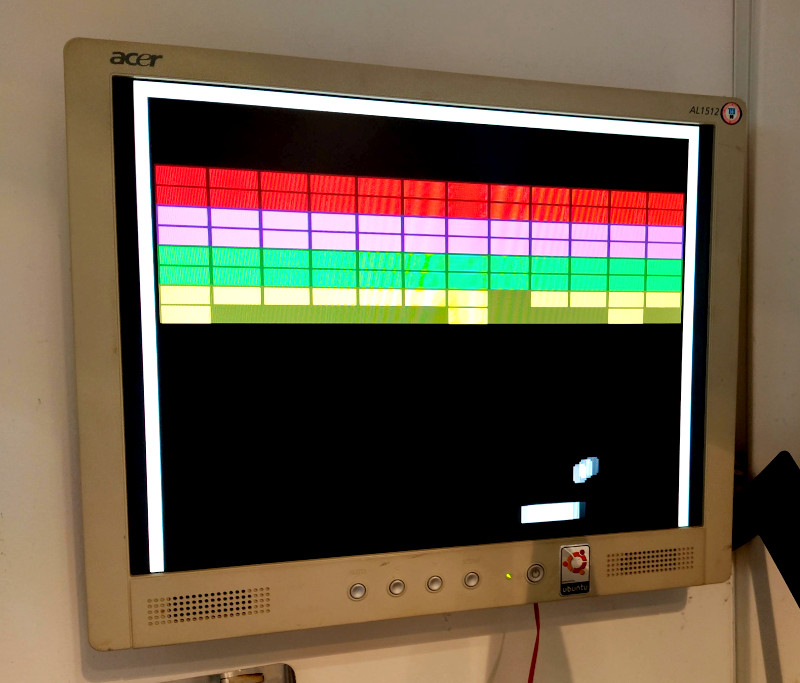

# FabGL El muro
8 bits or less classic breakout for FabGL

## About the game

When I was a child and I got my first ZX spectrum there was a demo tape with it. HORIZONS (spanish version). In the tape there was a game EL MURO (the wall). It was a terrible version of breakout, not funny at all to play. But nice to walk arounf the code.

I did this version in a copule of hours to test Fabrizio Di Vittorio VGADirectController. It has been funny.

## fabgl_elmuro 

https://github.com/carlesoriol/fabgl_elmuro

Thanks to www.FabGL.com - 2019 by Fabrizio Di Vittorio for this amazing library. This guy is really amazing, I've enjoyed a lot just watching the samples of his libraries it's so GREAT!!

Thanks to Shenzhen Xin Yuan Electronics for creating the funny TTGO VGA32 http://www.lilygo.cn/.

I't has been great playing with it.

Thanks to my Nurieta for being everything else in my life.

Since 10/10/2020

Version 0.1

Carles Oriol - Barcelona 2020
carlesoriol@gmail.com

## Game controls

- Mouse - Easiest to win
- Cursor keys

Play with friends or family is always more funny. Create your competitions.

## Game score

Just break all bricks, and it will start again. When you get bored stop.

You have 4 paddles to do this. 

## Hall of fame

There's no hall of fame, so you can record the screen with the mobile, betamax video cam, or 8mm or nobody will remember your name.

## License
[AGPL](https://choosealicense.com/licenses/agpl/)
